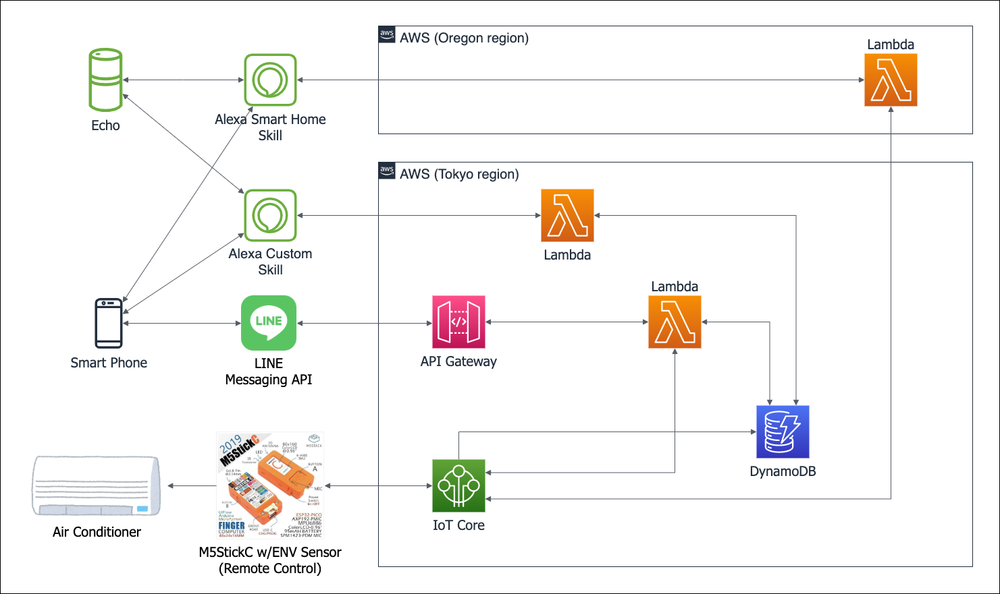

# line-bot-aws-iot

LINE Messaging API を使って AWS IoT Device Shadow 経由でエアコンを制御するサンプルです。

### Architecture



## Repository Layout

```text
.
|-- assets/
|   `-- images/        # rich menu や UI 用画像
|-- docs/              # 運用・移行ドキュメント
|-- infra/
|   `-- terraform/     # Terraform 定義（次フェーズで実装）
|-- scripts/           # デプロイ補助スクリプト
|-- src/
|   |-- handler.py     # Lambda 実装本体
|   |-- ac_remote.py
|   `-- env_monitor.py
`-- lambda_function.py # 互換エントリポイント
```

## Lambda Handler

- 現在の互換エントリポイント: `lambda_function.lambda_handler`
- 実装本体: `src.handler.lambda_handler`

既存設定との互換性を維持しつつ、今後は `src.handler.lambda_handler` へ統一していく前提です。

LINE 認証情報は SSM Parameter Store (`LINE_CHANNEL_SECRET_PARAM`, `LINE_CHANNEL_ACCESS_TOKEN_PARAM`) を参照する運用です。

## Packaging

Lambda デプロイ用アーティファクトは次のスクリプトで作成できます。

```bash
./scripts/package_lambda.sh
```

生成物:

- `dist/line-bot-aws-iot-lambda.zip`

## Terraform (Operations)

日常運用の手順は次を参照してください。

- [infra/terraform/README.md](infra/terraform/README.md)

## Local development

ローカルでも CI と同じ Python 品質チェックを実行できるようにしています。

### 1. Tooling setup

```bash
brew install mise
mise install
```

### 2. Run checks

```bash
make setup
make check
```

この環境では Python 3.12 と Ruff を使用します。

## Current Status

- Lambda / API Gateway / スロットリング / SSM 読み取り IAM は Terraform 管理済み
- Lambda の runtime / timeout / memory_size / environment は Terraform 管理済み
- Terraform state は専用 S3 backend + DynamoDB lock で運用

残タスクは次を参照してください。

- [docs/migration-plan.md](docs/migration-plan.md)
